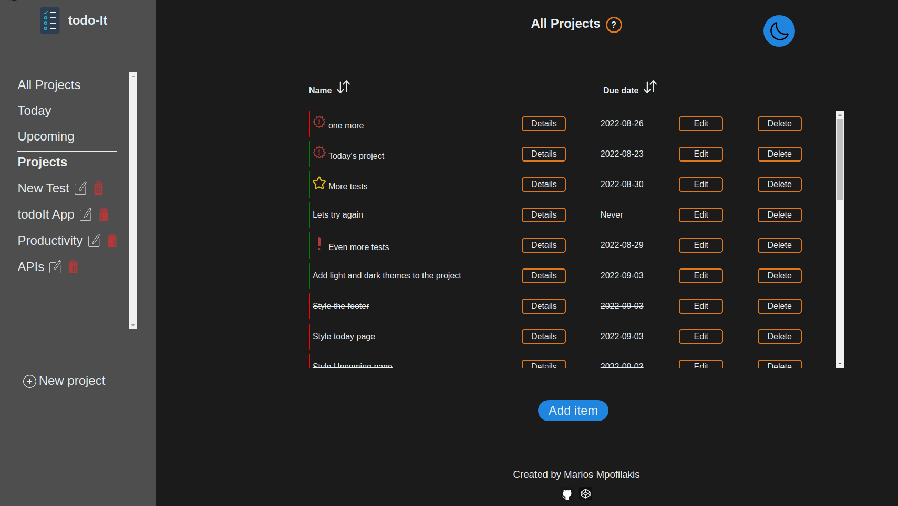
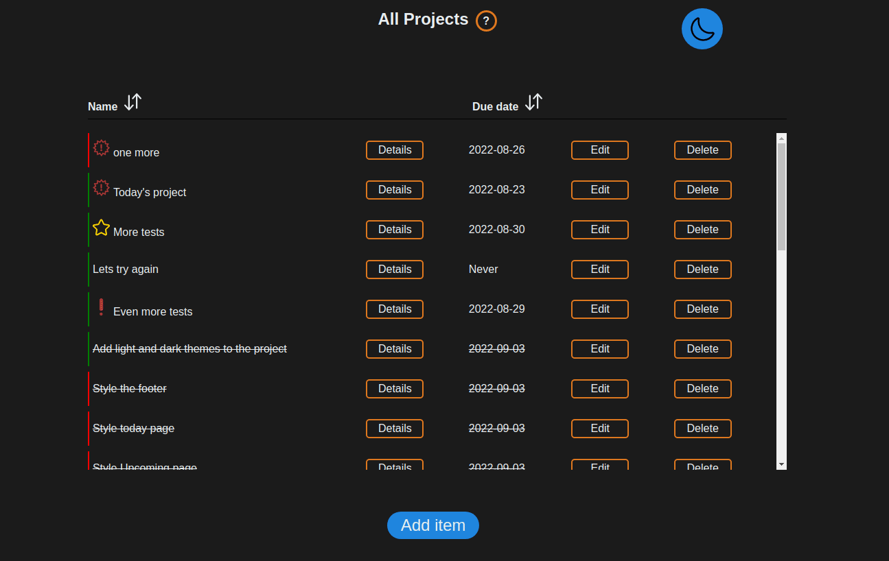
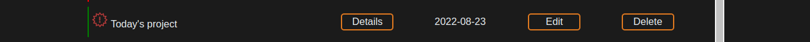
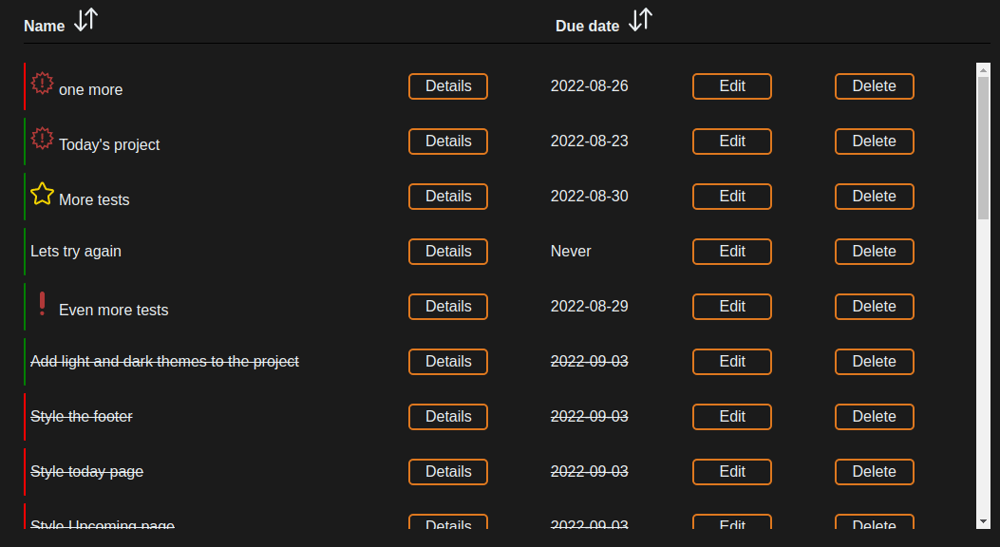
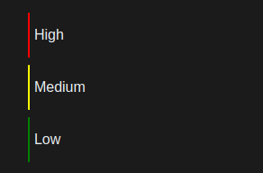
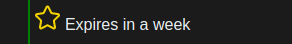
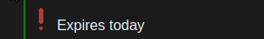
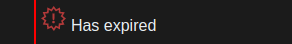
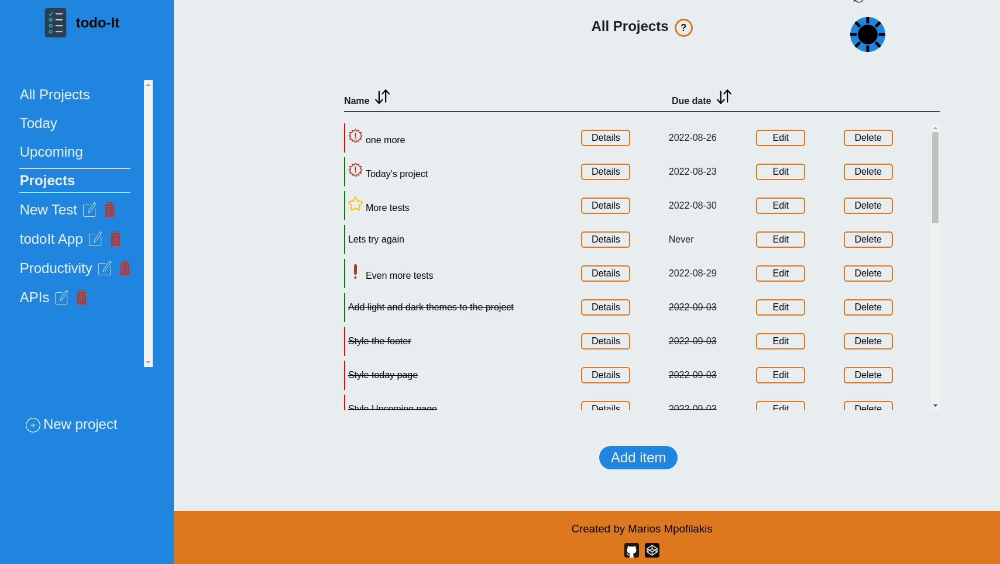

# todo-It

A simple, easy to use, todo web-app. Made with Javascript. [See it live here]().

# Features
* Add and remove todos to your projects. Modify already existing todos.
* Your todos are color-coded by their priority. A red line indicates a high priority, yellow are medium priority and green are low priority. 
* Be notified about the todos that are due to expire or have already expired. Todo-it will attach an icon next to the name of those todos.
* Sort your todos by name or due date in ascending or descending order.
* Create and remove projects from the nav bar or modify existing ones.
* See all your todos in one place with the All Projects screen. See all todos that are expiring today in the Today screen and the ones that are expiring within the week in the Upcoming screen.
* Keep your todos saved. Todoit uses local storage to save your projects to your browser.
* Choose between a dark and light theme.

# How to use
* Projects: Projects are the containers of todos in todo-It. Every todo item is associated with either a project or the global master project if no project is selected on creation. Projects can:
  * Be created by pressing the New Project button in the navbar and filling out the form that pops up. A project must have a name (1-10 characters long) and may optionally contain a short description (up to 130 characters).
  * Be deleted from your list. This is done by clicking the trashcan icon next to a project's name. Deleting a project will also delete all todo items that are associated with it.
  * Be edited by clicking the edit icon next to a project's name. Editing a project allows you to change a project's name and description.
  * If you'd like to inspect a project's description, you can do so by clicking the ? icon next to the project's name in the main section (see bellow).
  
* Main section: The main section is the area in the center of the screen. It consists of three sections:
  * The title section. This is the top of the page. It contains the title of the current page you are viewing and if that page is a project page, there will also be a ? button that allows you to view the description of that project. Here you will also find the button to change between the light and dark themes.
  * The todo list. This is a list of all the todo items that are relevant to the page you are viewing. The controls for individual todo items are explained in their own section.
  * The add item button. This button is used to create new todos. A todo must have a name of up to 30 characters in length and may optionally have:
    * A description of up to 130 characters in length.
    * A due date. If no due date is provided the item defaults to "Never".
    * A priority ranking between low, medium or high (low is the default).
    * A parent project. By default this is the project that you are currently viewing (or none if you are in the All Projects page).
  
* Todos:
  * An item can be marked as complete or incomplete by clicking it's name
    
  * Sorting your list can be done by pressing the buttons next to the name and due date fields (will sort by name and date respectively). Clicking those buttons again will change the direction of the sorting.
    
  * The details button brings up a modal with info about the corresponding item.
  * The edit button allows you to edit all info about an item, except the parent project.
  * Delete button deletes the item.
  * Todos are color coded depending on their priority. Red means high priority, yellow medium, green is low.

    
  * Icons next to an item represent that this particular item is expiring in a week (yellow star), today(exclamation point), or has already expired (exclamation point inside a star).

    

    
    
    

# Tech Stack
* [Webpack](https://webpack.js.org/) as the module bundler.
* Javascript used to generate the content.
* [SASS](https://sass-lang.com/) was used to generate the page styles.
* [date-fns](https://github.com/date-fns/date-fns) was used to handle dates.
* ES6's [Crypto API](https://developer.mozilla.org/en-US/docs/Web/API/Web_Crypto_API) was used to generate unique ids for the todos and projects
* Svgs where taken from [svgrepo](https://www.svgrepo.com/).

# Demo
